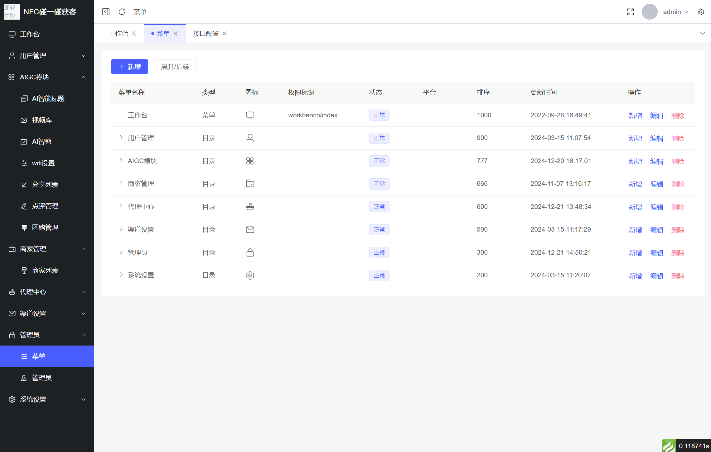
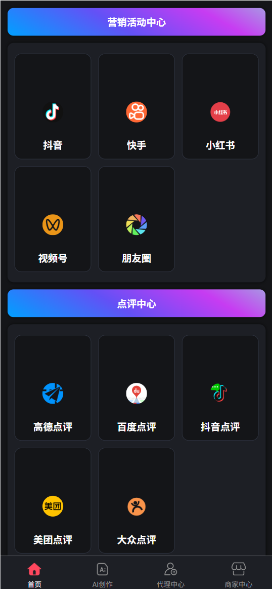
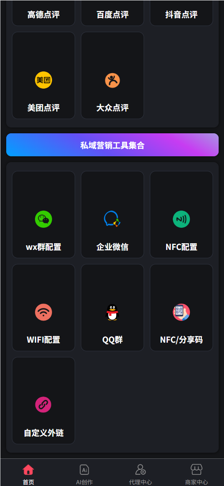
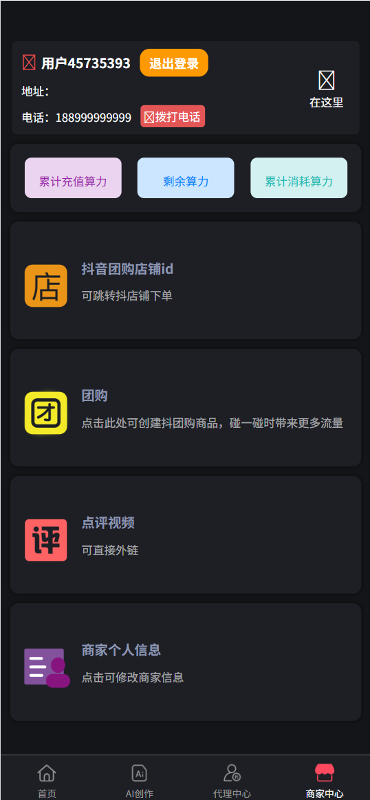
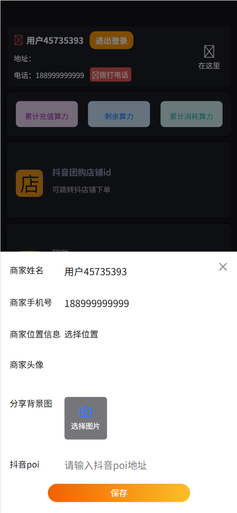

# 碰一碰·爆店码 - 线下门店多渠道营销引流系统

<div align="center">

[]()
[]()
[]()
[]()
[]()

一个为线下实体门店打造的智能营销系统，集成 NFC 碰一碰、爆店码、AI 视频混剪等功能，助力商家实现多平台内容分发和引流拓客

[功能特性](#功能特性) • [技术架构](#技术架构) • [快速开始](#快速开始) • [业务场景](#业务场景) • [项目结构](#项目结构)

</div>

---

## 💰 源码购买说明

<div align="center">

### 📢 重要声明

本项目为**付费源码**，仅供学习和商业使用

</div>

### 💳 购买信息

- **价格**：¥800（一次性付费）
- **交付内容**：完整源码 + 数据库文件 + 部署文档
- **使用说明**：
  - ✅ 可用于个人学习和商业项目
  - ✅ 可二次开发和定制
  - ✅ 保证源码完整可运行
  - ❌ 不提供售后技术支持
  - ❌ 不提供部署和配置服务
  - ❌ 不提供功能定制开发

### ⚠️ 购买须知

> **购买前请务必了解以下内容：**

1. **技术要求**：需要具备以下技术能力

   - PHP 开发经验（熟悉 ThinkPHP 框架）
   - Vue.js 开发经验（熟悉 Vue3 和 TypeScript）
   - 数据库管理能力（MySQL）
   - 服务器部署经验（Linux/宝塔面板）
   - 微信小程序开发经验（UniApp）

2. **不提供售后**：购买后不提供任何技术支持，请确保具备独立解决问题的能力

3. **环境准备**：需自行准备以下环境和服务

   - 服务器（云服务器或 VPS）
   - 域名和 SSL 证书
   - 阿里云服务（OSS 等，需付费）
   - 微信小程序账号
   - 支付接口（微信支付、支付宝）

4. **法律声明**：
   - 源码仅供合法用途使用
   - 不得用于违法违规业务
   - 购买即代表同意以上条款

### 📞 购买方式

<div align="center">

**扫码添加微信咨询购买**


**微信咨询后付款购买**

</div>

### 🔒 购买流程

1. 扫描上方二维码添加微信(wxid_sllf5dpkpadi22)
2. 说明购买意向，确认技术能力
3. 微信转账支付 ¥800
4. 获取源码下载链接
5. 下载源码并验证完整性

---

## 📖 项目简介

**碰一碰·爆店码**是一个专为线下实体门店（餐饮、零售、美业等）设计的全栈营销引流系统，通过集成多项创新技术，帮助商家实现线下到线上的无缝转化：

### 🎯 核心功能

- 📱 **NFC 碰一碰**：用户手机靠近标签即可触发营销活动，0 操作门槛
- 🎬 **爆店码**：一键分享视频到抖音/快手/小红书，自动带门店 POI 和话题标签
- ✍️ **AI 视频混剪**：集成阿里云 ICE，自动将素材片段混剪成完整短视频
- 📝 **AI 文案生成**：根据关键词自动生成种草文案和视频标题
- 📍 **多平台点评**：一键跳转到抖音/美团/大众点评/高德地图发布点评
- 📶 **WiFi 自动连接**：用户扫码自动连接门店 WiFi 并触发营销活动
- 🎁 **团购活动**：支持抖音团购、优惠券、会员卡等营销工具
- 👥 **代理商体系**：多级代理分销，快速扩展商家客户

### 核心业务流程

```
线下场景：
顾客进店 → 扫描二维码/NFC标签 → 跳转小程序活动中心
→ 选择营销动作（发视频/点评/加微信/领团购）
→ 一键发布到各大平台 → 自动带上门店位置和话题
→ 实现病毒式传播 → 为门店引流拓客

商家场景：
注册商家账号 → 配置门店信息和各平台POI
→ 上传视频素材 → AI生成混剪视频
→ 创建分享二维码/NFC标签 → 印刷到店面
→ 用户扫码分享 → 查看数据统计
```

---

## ✨ 功能特性

### 🎯 NFC 碰一碰营销

**什么是 NFC 碰一碰？**

NFC（近场通信）碰一碰技术让顾客只需将支持 NFC 功能的手机靠近商家的 NFC 标签，就能瞬间完成信息交互，无需扫码、无需打开 APP。

**核心优势：**

- **0 操作门槛**：用户手机靠近即可触发，无需扫码
- **触发速度快**：<1 秒完成跳转，体验流畅
- **高转化率**：相比扫码，参与率提升 50%+
- **多场景应用**：门口迎宾、收银台、餐桌、产品展示等

**应用场景：**

```
餐饮门店：
- 门口海报贴NFC标签 → 顾客碰一碰 → 领取新客优惠券/查看菜单

收银台：
- 结账时碰一碰 → 自动连接WiFi → 跳转点评页面 → 五星好评返现

产品展示：
- 商品旁贴NFC标签 → 碰一碰 → 查看详情/发布种草视频到小红书
```

**技术实现：**

- 支持小程序路径跳转
- 支持 WiFi 自动连接
- 支持加密 scheme 参数
- 支持多活动配置

### 🎬 爆店码：多平台视频分发

**什么是爆店码？**

爆店码是一种基于二维码的智能营销工具，用户扫码后可一键将商家准备好的视频发布到抖音、快手、小红书等短视频平台，视频会自动带上门店 POI（位置）和话题标签，实现病毒式传播。

**与传统二维码的区别：**

| 对比项   | 传统爆店码       | 碰一碰爆店码            |
| -------- | ---------------- | ----------------------- |
| 操作方式 | 扫码             | 手机靠近                |
| 平台支持 | 仅抖音           | 抖音/快手/小红书/视频号 |
| 参与率   | 20-30%           | 40-60%                  |
| 用户体验 | 需打开摄像头扫码 | 0 操作，靠近即可        |

**支持的分享平台：**

- ✅ 抖音（自动带 POI + 话题标签）
- ✅ 快手（OAuth 授权发布）
- ✅ 小红书（笔记 + 视频）
- ✅ 微信视频号
- ✅ 朋友圈（图文分享）

**业务流程：**

```
1. 商家创建分享内容
   ├─ 上传视频素材
   ├─ 设置标题和话题
   ├─ 关联门店POI
   └─ 生成分享二维码

2. 用户扫码或碰一碰
   ├─ 跳转到H5分享页
   ├─ 预览视频内容
   ├─ 点击"发布到抖音/快手"
   └─ 自动授权并发布

3. 自动发布
   ├─ 调用平台开放API
   ├─ 自动填充标题和位置
   ├─ 自动添加话题标签
   └─ 发布成功，统计数据
```

**核心价值：**

- **降低发布门槛**：用户无需自己拍摄和剪辑
- **统一内容质量**：商家提供专业素材
- **精准引流**：自动带门店位置和话题
- **数据可追踪**：统计每个二维码的分享次数

### ✍️ AI 视频混剪系统

**集成阿里云智能媒体生产（ICE）**

- **视频素材库管理**：支持商家上传多个视频片段，建立专属素材库
- **AI 标题生成**：根据关键词自动生成吸引眼球的视频标题
- **一键成片**：
  - 自动选择素材中的精彩片段
  - 智能转场和特效
  - 配乐自适应视频节奏
  - 输出高清视频（支持 720P/1080P）
- **异步处理**：提交任务后台处理，3-5 分钟自动生成
- **成品管理**：查看历史混剪视频，支持预览和下载

**使用场景：**

```
餐饮店：
上传5-10个菜品特写镜头 → AI混剪成30秒宣传片
→ 配上"探店美食"标题 → 生成爆店码 → 顾客扫码分享

美容院：
上传护理前后对比视频 → AI混剪成变美故事
→ 配上"变美日记"标题 → 分享到小红书

服装店：
上传穿搭展示视频 → AI混剪成时尚VLOG
→ 配上"今日穿搭"标题 → 发布到抖音
```

### 📝 AI 文案生成

**智能关键词扩写**

- **批量生成**：输入关键词，AI 自动生成 5-1000 字营销文案
- **多场景应用**：
  - 视频标题和副标题
  - 小红书种草文案
  - 产品详情描述
  - 朋友圈推广文案
- **一键复制**：生成后一键复制到各个平台

**示例：**

```
输入关键词："火锅、麻辣、成都"
AI生成：
1. "成都正宗老火锅，麻辣鲜香一锅鲜！地道四川味，等你来打卡"
2. "藏在巷子里的宝藏火锅店！老板是成都人，麻辣底料现炒现用"
3. "火锅控必打卡！这家店的牛油锅底绝了，麻辣过瘾不上火"
...共100条供选择
```

### 📍 多平台点评引流

**一键跳转到各大平台发布点评**

支持的点评平台：

- 🎵 抖音生活服务点评
- 🍔 美团点评
- 🍽️ 大众点评
- 🗺️ 高德地图点评
- 🗺️ 百度地图点评

**点评场景设计：**

```
用户结账后 → 收银员引导"扫码领现金"
→ 用户扫码 → 跳转活动中心
→ 显示"发布5星好评返现10元"
→ 自动复制好评文案 → 一键跳转点评页面
→ 用户发布后截图 → 返现到账
```

**关键配置：**

- 抖音 POI ID（门店在抖音生活服务的 ID）
- 美团店铺 ID
- 高德/百度跳转链接
- 好评文案模板

### 📶 WiFi 自动连接

**扫码连 WiFi + 触发营销**

传统 WiFi 连接：用户需要手动搜索 WiFi → 输入密码 → 连接

碰一碰 WiFi：用户扫码/碰标签 → 自动连接 WiFi → 跳转活动页面

**应用场景：**

```
1. 餐饮门店：
   用户点餐等待 → 桌面扫码连WiFi
   → 自动跳转菜单 → 推荐新品/优惠活动

2. 奶茶店：
   用户排队等待 → 扫码连WiFi
   → 自动跳转小游戏 → 玩游戏得优惠券

3. 美容院：
   顾客护理中 → 扫码连WiFi
   → 自动跳转项目介绍 → 推荐续卡优惠
```

**技术特点：**

- 支持一键连接（iOS 需配置描述文件）
- 可配置连接后跳转页面
- 支持 WiFi 密码加密存储
- 支持多 WiFi 管理（多店铺）

### 🎁 团购与优惠活动

**支持抖音团购集成**

- 配置抖音团购活动 ID
- 用户扫码直达团购页面
- 自动统计团购数据
- 支持核销码验证

**优惠券系统**

- 发放新客优惠券
- 满减券、折扣券
- 限时抢购券
- 优惠券使用记录

### 👥 代理商体系

**多级分销系统**

- **代理申请**：任何用户都可以申请成为代理商
- **佣金结算**：
  - 代理商推广商家，商家消费时自动获得佣金
  - 佣金比例可灵活配置（10%-30%）
- **提现管理**：支持提现到微信零钱或银行卡
- **数据统计**：
  - 推广商家数量
  - 累计佣金收益
  - 下级商家消费明细

**代理商场景：**

```
地推人员 → 申请成为代理
→ 推广给餐饮商家
→ 商家注册并充值1000元
→ 代理获得200元佣金（20%）
→ 持续获得该商家的消费分成
```

---

## 🏗️ 技术架构

### 整体架构

```
┌─────────────────────────────────────────────────────────┐
│                  MySQL数据库 (pypkycs)                   │
│       45+张表 | 表前缀: zwzd_ | 核心表：                 │
│       - zwzd_store (门店)                                │
│       - zwzd_store_config (门店营销配置)                 │
│       - zwzd_share (分享记录)                            │
│       - zwzd_wifi (WiFi配置)                             │
│       - zwzd_buying (团购商品)                           │
└─────────────────────┬───────────────────────────────────┘
                      │
      ┌───────────────┼───────────────┐
      │               │               │
┌─────▼──────┐  ┌────▼─────┐   ┌────▼──────┐
│  Admin API │  │AdminAPI  │   │  Index    │
│  公开接口  │  │ 后台接口 │   │  API      │
│ ThinkPHP8  │  │ThinkPHP8 │   │           │
│            │  │          │   │           │
│ - 分享发布 │  │- 门店管理│   │           │
│ - WiFi连接 │  │- 代理商  │   │           │
│ - 快手授权 │  │- 数据统计│   │           │
└─────┬──────┘  └────┬─────┘   └────┬──────┘
      │              │              │
      │         ┌────▼────┐         │
      │         │  Redis  │         │
      │         │ 缓存层  │         │
      │         └─────────┘         │
      └──────────────┬──────────────┘
                     │
     ┌───────────────┼─────────────────────┐
     │               │                     │
┌────▼──────────┐ ┌─▼──────────┐   ┌─────▼────────────┐
│  admin-vue    │ │channel-    │   │  channel-wxapp   │
│  管理后台     │ │share       │   │  微信小程序      │
│  Vue3 + TS    │ │H5分享页    │   │  UniApp          │
│  Element Plus │ │UniApp      │   │                  │
│               │ │            │   │  pages:          │
│  - 门店配置   │ │快手分享页  │   │  - 活动中心      │
│  - 分享管理   │ │H5扫码页    │   │  - 创建分享      │
│  - 数据报表   │ │            │   │  - 团购商品      │
└───────────────┘ └────────────┘   └──────────────────┘
     (管理员)        (扫码用户)          (商家/用户)
```

### 核心数据流

**爆店码分享流程：**

```
商家端（小程序）:
  创建分享 → POST /api/share/publishShare
           → 数据库：zwzd_share
           → 返回：share_id

生成二维码/NFC标签：
  URL: /channel-share/pages/kuaishou/index?code=xxx
  或: 加密的NFC scheme

用户端（H5）:
  扫码/碰一碰 → GET /api/common/getKuaiShouUrl?code=xxx
              → 返回：视频标题、封面、URL
  点击发布 → POST /api/common/publicKuaiShouUrl
           → 调用快手OAuth API
           → 自动发布视频
```

**NFC 碰一碰流程：**

```
商家配置：
  admin-vue → 门店设置 → 配置nfc_scheme
          → 生成加密链接
          → 写入NFC标签

用户使用：
  手机靠近NFC标签 → 自动识别scheme
                  → 跳转小程序指定页面
                  → 显示活动中心
```

### 技术栈

#### 后端 (admin/)

| 技术     | 版本  | 用途       |
| -------- | ----- | ---------- |
| PHP      | 8.0+  | 运行环境   |
| ThinkPHP | 8.0.2 | 后端框架   |
| MySQL    | 5.7+  | 数据存储   |
| Redis    | 6.0+  | 缓存和会话 |
| Composer | 2.x   | 依赖管理   |

**核心依赖库**：

- **EasyWeChat 6.8** - 微信集成（登录、支付、消息）
- **阿里云 SDK** - OSS 存储、AI 文案
- **快手开放平台 SDK** - OAuth 授权、视频发布
- **支付宝 EasySDK** - 支付集成
- **WorkerMan 4.2** - 异步任务和定时器

#### 前端管理后台 (admin-vue/)

| 技术         | 版本  | 用途       |
| ------------ | ----- | ---------- |
| Vue          | 3.5.3 | 前端框架   |
| Vite         | 5.4.3 | 构建工具   |
| TypeScript   | 5.6.2 | 类型检查   |
| Element Plus | 2.8.2 | UI 组件库  |
| Pinia        | 2.2.2 | 状态管理   |
| ECharts      | 5.5.1 | 数据可视化 |

#### 移动端 (channel-wxapp/ & channel-share/)

| 技术     | 版本 | 用途          |
| -------- | ---- | ------------- |
| UniApp   | Vue2 | 跨平台框架    |
| uView UI | 2.0  | UniApp 组件库 |

**支持平台**：

- ✅ 微信小程序
- ✅ H5
- ✅ 支付宝小程序
- ✅ QQ 小程序
- ✅ 抖音小程序
- ✅ 快手小程序

---

## 🚀 快速开始

### 环境要求

| 环境     | 版本要求 | 说明              |
| -------- | -------- | ----------------- |
| PHP      | >= 8.0   | 必须支持 composer |
| MySQL    | >= 5.7   | 推荐 8.0+         |
| Redis    | >= 6.0   | 用于缓存和会话    |
| Node.js  | >= 16.0  | 用于前端构建      |
| Composer | 2.x      | PHP 依赖管理      |

### ⚠️ 重要提示：阿里云服务准备

本项目的 AI 混剪功能依赖阿里云服务，使用前需要提前准备：

#### 必需的阿里云服务


1. **对象存储（OSS）** - 媒体文件存储

   - 开通地址：https://oss.console.aliyun.com/
   - 用途：视频、图片素材存储
   - 计费：按存储空间和流量计费

2. **AI 内容生成** - 文案生成（可选）
   - 开通地址：https://www.aliyun.com/product/ai
   - 用途：关键词扩写为营销文案
   - 计费：按调用次数计费

#### 获取阿里云配置参数

登录阿里云控制台获取以下参数：

- `AccessKey ID`
- `AccessKey Secret`
- `OSS Bucket名称`
- `OSS 域名`


配置位置：管理后台 → 系统设置 → 存储配置

---

### 📦 安装步骤

#### 1. 数据库初始化

```bash
# 创建数据库
mysql -u root -p
CREATE DATABASE pypkycs DEFAULT CHARACTER SET utf8mb4 COLLATE utf8mb4_unicode_ci;
exit;

# 导入数据
mysql -u root -p pypkycs < pyp.sql
```

#### 2. 启动后端服务

```bash
# 进入后端目录
cd admin

# 安装PHP依赖
composer install

# 配置数据库连接
# 编辑 config/database.php，修改以下配置：
#   - hostname: 127.0.0.1
#   - database: pypkycs
#   - username: root
#   - password: 你的密码
#   - prefix: zwzd_

# 配置Redis连接
# 编辑 config/cache.php，确认Redis配置：
#   - host: 127.0.0.1
#   - port: 6379

# 启动Redis（如果未启动）
# Windows:
net start Redis
# 或直接运行: redis-server

# Linux/Mac:
redis-server

# 验证Redis
redis-cli ping  # 应返回 PONG

# 启动后端API服务（默认端口8000）
php think run

# 或指定端口
php think run -p 8080
```

#### 3. 启动定时任务（重要）

混剪任务提交到阿里云后需要定时轮询结果：

```bash
# 在admin目录下，新开一个终端

# 前台运行（推荐用于开发，便于观察日志）
php think timer start

# 后台守护运行（用于生产环境）
php think timer start -d

# 停止定时任务
php think timer stop
```

> 📌 定时任务默认每 10 秒轮询一次阿里云，同步混剪结果和 AI 文案生成结果。
> 可在 `app/common/command/Timer.php` 中调整轮询间隔。

#### 4. 启动管理后台前端

```bash
# 进入前端目录
cd admin-vue/admin-vue

# 安装依赖
npm install

# 启动开发服务器（默认端口5173）
npm run dev

# 构建生产版本
npm run build
```

访问管理后台：http://localhost:5173

#### 5. 运行微信小程序

```bash
# 进入小程序目录
cd channel-wxapp/channel-wxapp

# 安装依赖
npm install

# 使用HBuilderX打开项目并运行到微信开发者工具

# 或使用命令行编译
npm run dev:mp-weixin  # 微信小程序
npm run dev:h5         # H5版本
```

> 📱 需要在微信开发者工具中导入 `channel-wxapp/channel-wxapp` 目录
> AppID 需替换为你的小程序 AppID

#### 6. 运行 H5 分享页

```bash
# 进入分享页目录
cd channel-share/channel-share

# 安装依赖
npm install

# 编译H5
npm run dev:h5
```

---

### 🔧 系统配置

#### 后台初始账号

登录管理后台：http://localhost:5173

```
用户名：admin
密码：admin123
```

> ⚠️ 首次登录后请立即修改密码！

#### 必需的配置项

登录管理后台后，进入 **系统设置** 完成以下配置：

1. **门店基本信息**（必需）

   - 门店名称、地址、坐标
   - 门店 Logo
   - 联系方式

2. **平台 POI 配置**（必需）

   - 抖音门店 POI ID
   - 美团店铺 ID
   - 高德地图跳转链接
   - 百度地图跳转链接

3. **存储配置**（必需）

   - 阿里云 OSS 配置
   - AccessKey ID/Secret
   - Bucket 名称和域名

4. **支付配置**（必需）

   - 微信支付配置（AppID、商户号、密钥）
   - 支付宝配置（AppID、公钥、私钥）

5. **快手开放平台**（可选）

   - Client Key
   - Client Secret
   - 用于快手视频分享授权

6. **抖音开放平台**（可选）
   - Client Key
   - Client Secret
   - 用于抖音视频分享授权

---

### 🛠️ 常用命令

#### 后端命令

```bash
# 查看所有可用命令
php think list

# 查看路由列表
php think route:list

# 清理缓存
php think clear

# 查看版本
php think version

# 停止定时任务
php think timer stop
```

#### 前端命令

```bash
# admin-vue/
npm run dev          # 开发模式
npm run build        # 生产构建
npm run preview      # 预览构建结果
npm run type-check   # TypeScript类型检查

# channel-wxapp/ 或 channel-share/
npm run dev:mp-weixin    # 微信小程序
npm run dev:h5           # H5
npm run build:mp-weixin  # 构建微信小程序
npm run build:h5         # 构建H5
```

---

### ❗ 常见问题

#### 1. Redis 连接失败

错误提示：`由于目标计算机积极拒绝，无法连接`

解决方案：

```bash
# 检查Redis是否启动
redis-cli ping

# 如未启动，启动Redis
# Windows:
net start Redis

# Linux/Mac:
redis-server
```

检查配置文件 `config/cache.php`：

```php
'host' => '127.0.0.1',
'port' => 6379,
'password' => '',  // 如有密码请填写
```

#### 2. 验证码不显示

**原因**：项目路径包含中文字符时，GD 库无法正确加载 TTF 字体。

**解决方案**：已修改验证码类使用内置字体，无需额外处理。

相关文件：

- 配置：`config/captcha.php`
- 验证码类：`vendor/topthink/think-captcha/src/Captcha.php`

#### 3. 混剪任务失败

检查项：

- ✅ 是否开通混剪服务
- ✅ AccessKey 是否正确配置
- ✅ OSS 素材是否上传成功
- ✅ ICE 账户余额是否充足
- ✅ 定时任务是否正在运行

查看日志：

```bash
# 查看运行时日志
tail -f runtime/log/当前日期.log
```

#### 4. 快手/抖音分享失败

检查项：

- ✅ 是否在快手/抖音开放平台创建应用
- ✅ Client Key 和 Client Secret 是否正确
- ✅ 回调域名是否配置（需要外网可访问）
- ✅ 应用是否通过审核

#### 5. NFC 标签无法跳转

检查项：

- ✅ 手机是否支持 NFC 功能
- ✅ NFC 功能是否已开启
- ✅ scheme 是否正确配置
- ✅ 小程序是否已发布（体验版可能无法跳转）

---

## 💡 业务场景示例

### 场景 1：餐饮店使用爆店码引流

```
前期准备：
1. 商家在管理后台配置门店信息
   └─ 门店名称：老成都火锅
   └─ 抖音POI：1234567890
   └─ 美团店铺ID：9876543210
   ↓
2. 在小程序创建分享
   └─ 上传5个菜品视频 → AI混剪成30秒宣传片
   └─ AI生成标题："成都正宗老火锅，麻辣鲜香一锅鲜"
   └─ 生成爆店码二维码
   ↓
3. 印刷海报并张贴在店门口

运营场景：
1. 顾客排队等位 → 扫描海报上的爆店码
   ↓
2. 跳转到H5分享页 → 显示火锅视频预览
   ↓
3. 顾客点击"发布到抖音"
   ↓
4. 自动授权登录抖音 → 自动填充标题和POI
   ↓
5. 视频发布成功 → 自动带上门店位置和#探店美食话题
   ↓
6. 商家奖励：顾客出示发布截图 → 送可乐一瓶
   ↓
7. 效果：100个顾客分享 → 覆盖10万+用户 → 吸引200+到店
```

### 场景 2：奶茶店使用 NFC 碰一碰营销

```
前期准备：
1. 商家购买NFC标签（10元/个）
   ↓
2. 在管理后台配置NFC跳转
   └─ 跳转页面：活动中心
   └─ 活动内容：新品推荐 + 优惠券
   ↓
3. 将NFC标签贴在收银台、桌面、门口

运营场景：
1. 顾客下单等待 → 手机靠近桌面NFC标签
   ↓
2. 自动跳转小程序活动中心
   └─ 显示新品"杨枝甘露冰" + 领取5元券
   ↓
3. 顾客领券 → 自动连接门店WiFi
   ↓
4. 显示"发朋友圈送券"活动
   ↓
5. 顾客点击"生成海报" → 保存图片发朋友圈
   ↓
6. 出示朋友圈截图 → 再送5元券
   ↓
7. 效果：每天100+顾客参与 → 社交裂变触达3000+人
```

### 场景 3：美容院使用多平台点评获客

```
前期准备：
1. 配置点评平台信息
   └─ 美团店铺ID
   └─ 大众点评店铺ID
   └─ 抖音生活服务POI
   ↓
2. 设置好评返现活动
   └─ 5星好评返现20元
   └─ 上传照片额外返10元
   ↓
3. 准备好评文案模板

运营场景：
1. 顾客护理结束 → 美容师引导扫码
   ↓
2. 跳转活动中心 → 显示"发布5星好评返现30元"
   ↓
3. 顾客点击"去美团点评"
   └─ 自动复制好评文案："超赞的护理体验..."
   └─ 跳转到美团APP点评页
   ↓
4. 顾客发布5星好评 + 上传照片
   ↓
5. 顾客返回小程序 → 上传点评截图
   ↓
6. 美容师审核 → 通过后返现30元到账
   ↓
7. 效果：月增200+真实好评 → 店铺评分4.8→4.9 → 订单量提升40%
```

### 场景 4：代理商推广商家赚佣金

```
代理商运营：
1. 地推人员申请成为代理商
   └─ 管理员审核通过
   └─ 设置佣金比例：30%
   ↓
2. 代理商拜访本地餐饮商家
   └─ 演示爆店码和碰一碰功能
   └─ 现场扫码体验效果
   ↓
3. 商家注册并充值3000元
   └─ 代理商立即获得900元佣金（30%）
   ↓
4. 商家后续充值和消费
   └─ 代理商持续获得分成
   ↓
5. 效果：推广10家商家 → 月入8000-15000元佣金
```

---

## 🎯 核心优势

### 技术优势

1. **NFC 技术创新** - 比传统二维码转化率提升 50%+，用户体验更流畅
2. **多平台集成** - 打通抖音、快手、小红书、美团、高德等主流平台
3. **阿里云 AI 加持** - 企业级 AI 视频生产能力，自动剪辑、转场、配乐
4. **异步任务处理** - WorkerMan 定时器，不阻塞用户操作
5. **完整的权限体系** - 四层权限架构，精细化控制
6. **多端统一** - UniApp 跨平台，一套代码多端运行

### 商业优势

1. **降低营销门槛** - 商家无需专业运营人员，系统自动化完成
2. **提高转化效率** - NFC 碰一碰参与率 40-60%，远超扫码 20-30%
3. **精准引流** - 自动带 POI 和话题，视频种草效果显著
4. **多渠道覆盖** - 一次配置，多平台分发，覆盖更广
5. **数据可追踪** - 统计每个活动的参与数、分享数、转化数
6. **代理商裂变** - 多级分销体系，快速扩展商家客户

### 行业适用性

✅ **餐饮行业**：火锅、烧烤、奶茶、咖啡、快餐等
✅ **零售行业**：服装、鞋帽、数码、化妆品等
✅ **美业**：美容、美发、美甲、纹绣等
✅ **娱乐休闲**：KTV、影院、健身房、密室逃脱等
✅ **生活服务**：超市、便利店、洗车、维修等

---

## 📁 项目结构

```
碰一碰·爆店码/
│
├── admin/                      # 后端API服务器 (ThinkPHP 8)
│   ├── app/
│   │   ├── api/                # 公开API模块
│   │   │   ├── controller/
│   │   │   │   ├── ShareController.php        # 分享发布核心
│   │   │   │   ├── WifiController.php         # WiFi连接
│   │   │   │   ├── StoreController.php        # 门店配置
│   │   │   │   ├── BuyingController.php       # 团购商品
│   │   │   │   └── ProducevideoController.php # AI混剪
│   │   │   ├── logic/
│   │   │   │   ├── ShareLogic.php             # 分享业务逻辑
│   │   │   │   ├── WifiLogic.php              # WiFi业务逻辑
│   │   │   │   └── ProducevideoLogic.php      # 混剪业务逻辑
│   │   │   └── validate/
│   │   │
│   │   ├── adminapi/           # 管理后台API模块
│   │   │   ├── controller/
│   │   │   │   ├── StoreConfigController.php  # 门店配置管理
│   │   │   │   ├── AgentController.php        # 代理商管理
│   │   │   │   └── ShareController.php        # 分享管理
│   │   │   └── logic/
│   │   │
│   │   ├── common/             # 通用模块
│   │   │   ├── model/
│   │   │   │   ├── Store.php              # 门店模型
│   │   │   │   ├── StoreConfig.php        # 门店配置
│   │   │   │   ├── Share.php              # 分享记录
│   │   │   │   ├── Wifi.php               # WiFi配置
│   │   │   │   └── Buying.php             # 团购商品
│   │   │   ├── service/
│   │   │   │   └── aliyun/
│   │   │   │       ├── ProducevideoService.php  # 阿里云混剪API
│   │   │   │       └── GenerateTextService.php  # AI文案生成
│   │   │   └── command/
│   │   │       └── Timer.php               # 定时任务
│   │   │
│   │   └── index/              # 首页模块
│   │
│   ├── config/                 # 配置文件
│   ├── public/                 # 入口文件
│   ├── vendor/                 # Composer依赖
│   └── composer.json
│
├── admin-vue/                  # 管理后台前端 (Vue 3)
│   └── admin-vue/
│       ├── src/
│       │   ├── api/
│       │   │   ├── store.ts            # 门店API
│       │   │   ├── share.ts            # 分享API
│       │   │   ├── wifi.ts             # WiFi API
│       │   │   ├── buying.ts           # 团购API
│       │   │   ├── agent.ts            # 代理商API
│       │   │   └── media.ts            # 混剪API
│       │   │
│       │   ├── views/
│       │   │   ├── store/              # 门店管理
│       │   │   │   ├── config.vue      # 门店配置
│       │   │   │   └── share.vue       # 分享管理
│       │   │   ├── agent/              # 代理商管理
│       │   │   ├── channel/            # 渠道管理
│       │   │   └── dashboard/          # 数据仪表盘
│       │   │
│       │   ├── components/
│       │   ├── stores/
│       │   └── router/
│       │
│       ├── vite.config.ts
│       └── package.json
│
├── channel-wxapp/              # 微信小程序 (UniApp)
│   └── channel-wxapp/
│       ├── pages/
│       │   ├── index/                  # 首页
│       │   ├── store/
│       │   │   └── share/              # 活动中心（核心）
│       │   │       └── index.vue       # 多渠道营销菜单
│       │   ├── shop/
│       │   │   ├── kuaishou/           # 快手分享（爆店码）
│       │   │   │   ├── create.vue      # 创建快手分享
│       │   │   │   └── list.vue        # 分享列表
│       │   │   ├── dy/                 # 抖音分享
│       │   │   │   ├── create.vue
│       │   │   │   └── list.vue
│       │   │   ├── xiaohongshu/        # 小红书分享
│       │   │   │   ├── create.vue
│       │   │   │   └── list.vue
│       │   │   └── create/             # AI混剪创建
│       │   │       └── media/
│       │   ├── agent/                  # 代理商功能
│       │   │   ├── apply/              # 申请代理
│       │   │   ├── record/             # 佣金记录
│       │   │   └── withdraw/           # 提现管理
│       │   └── data/                   # 数据统计
│       │
│       ├── components/
│       ├── api/
│       │   ├── common.js               # 通用API（含快手授权）
│       │   └── store.js                # 门店API
│       ├── manifest.json
│       └── pages.json
│
├── channel-share/              # H5分享页 (UniApp)
│   └── channel-share/
│       ├── pages/
│       │   ├── kuaishou/               # 快手分享页（爆店码核心）
│       │   │   └── index.vue           # 显示视频+发布按钮
│       │   └── share/                  # 通用分享中转页
│       │       └── index.vue
│       ├── api/
│       ├── manifest.json
│       └── pages.json
│
├── pyp.sql                     # 数据库初始化脚本
├── 启动.md                     # 启动说明文档
├── CLAUDE.md                   # 开发指南
└── README.md                   # 本文件
```

### 核心文件说明

| 文件路径                                                  | 功能描述                 |
| --------------------------------------------------------- | ------------------------ |
| `admin/app/api/controller/ShareController.php`            | 分享发布控制器           |
| `admin/app/api/logic/ShareLogic.php`                      | 分享业务逻辑（含爆店码） |
| `admin/app/api/controller/WifiController.php`             | WiFi 连接控制器          |
| `admin/app/common/model/StoreConfig.php`                  | 门店营销配置模型         |
| `channel-wxapp/pages/store/share/index.vue`               | 活动中心（多渠道营销）   |
| `channel-wxapp/pages/shop/kuaishou/create.vue`            | 创建快手分享（爆店码）   |
| `channel-share/pages/kuaishou/index.vue`                  | 快手 H5 分享页           |
| `admin/app/common/service/aliyun/ProducevideoService.php` | 阿里云混剪 API           |

---

## 🗄️ 数据库设计

### 核心数据表

#### 门店相关

- `zwzd_store` - 门店基本信息（名称、地址、坐标、Logo）
- `zwzd_store_config` - 门店营销配置（NFC、POI、WiFi 等）

**zwzd_store_config 关键字段：**

```sql
nfc_scheme          -- NFC加密跳转链接
scheme              -- 普通二维码加密链接
mini_program_link   -- 小程序跳转路径
douyin_poi          -- 抖音门店POI ID
douyin_store_id     -- 抖音门店ID
meituan_param       -- 美团跳转链接
meituan_dian_id     -- 美团店铺ID
dazhong_param       -- 大众点评跳转链接
gaode_param         -- 高德地图跳转链接
baidu_param         -- 百度地图跳转链接
xiaohognshu_param   -- 小红书跳转链接
pengyouquan_param   -- 朋友圈生成链接
lianjiewifi         -- WiFi连接开关（1开0关）
douyindianping      -- 抖音点评开关
meituandianping     -- 美团点评开关
dazhongdianping     -- 大众点评开关
```

#### 分享相关（爆店码）

- `zwzd_share` - 分享记录

**zwzd_share 关键字段：**

```sql
user_id             -- 创建用户ID
store_id            -- 门店ID
share_type          -- 分享类型（1抖音 2小红书 3快手）
type                -- 内容类型（1单图 2多图 3视频）
title               -- 分享标题
cover_image         -- 封面图
publish_url         -- 视频URL或图片ID
poi_id              -- 门店POI地址
status              -- 状态（1启用 0禁用）
create_time         -- 创建时间
```

#### WiFi 相关

- `zwzd_wifi` - WiFi 配置

**zwzd_wifi 关键字段：**

```sql
store_id            -- 门店ID
SSID                -- WiFi名称
BSSID               -- WiFi物理地址
password            -- WiFi密码（加密存储）
maunal              -- 是否手动跳转（1是 0否）
code                -- 扫码二维码内容
```

#### 团购相关

- `zwzd_buying` - 团购商品

**zwzd_buying 关键字段：**

```sql
store_id            -- 门店ID
title               -- 商品标题
price               -- 价格
original_price      -- 原价
activity_id         -- 抖音活动ID
image               -- 商品图片
stock               -- 库存
status              -- 状态
```

#### 用户与代理商

- `zwzd_user` - 用户表
- `zwzd_user_account_log` - 用户账户流水
- `zwzd_agent` - 代理商信息
- `zwzd_agent_account_log` - 代理商流水

#### AI 混剪相关

- `zwzd_video` - 视频素材库
- `zwzd_video_list` - 视频素材详情
- `zwzd_media` - 混剪任务
- `zwzd_media_list` - 混剪结果列表
- `zwzd_keyword` - 关键词库
- `zwzd_describe` - AI 文案库

---

## 🔐 安全说明

### 已实施的安全措施

- ✅ 密码加密存储（bcrypt/password_hash）
- ✅ API 接口鉴权（Token 机制）
- ✅ SQL 注入防护（ThinkPHP ORM）
- ✅ XSS 防护（输入过滤、输出转义）
- ✅ CSRF 防护（Token 验证）
- ✅ 文件上传限制（类型、大小、扩展名）
- ✅ 支付签名验证（微信、支付宝官方 SDK）
- ✅ NFC scheme 加密（防止伪造）
- ✅ WiFi 密码加密存储

### 生产环境建议

1. **启用 HTTPS** - 所有域名必须使用 SSL 证书
2. **配置防火墙** - 限制数据库和 Redis 端口访问
3. **定期备份** - 数据库每日备份，日志定期归档
4. **监控告警** - 配置服务器监控和异常告警
5. **密钥管理** - 不要在代码中硬编码密钥，使用环境变量
6. **权限最小化** - 数据库用户权限按需分配

---

## 📊 系统截图

### 管理后台

<div align="center">



**管理后台菜单** - 支持工作台、用户管理、AI 模块、视频库、点评管理、团购管理等完整功能模块

</div>

---

### 微信小程序 - 活动中心

<div align="center">



**营销活动中心** - 用户扫码/碰一碰后的多渠道营销入口

包含：

- 发视频/种草：抖音、快手、小红书、视频号、朋友圈
- 点评中心：高德点评、百度点评、抖音点评、美团点评、大众点评

</div>

---

### 私域营销工具集合

<div align="center">



**私域营销工具集合**

包含功能：

- wx 群配置：微信群引流
- 企业微信：企微客户管理
- NFC 配置：NFC 标签管理
- WiFi 配置：一键连 WiFi
- QQ 群：QQ 群引流
- NFC/分享码：二维码/NFC 混合方案
- 自定义外链：自定义跳转

</div>

---

### 商家中心

<div align="center">



**商家中心** - 商家信息管理和数据统计

功能模块：

- 累计充值算力、剩余算力、累计消耗算力
- 抖音团购店铺 ID 配置
- 团购商品管理
- 点评视频直接外链
- 商家个人信息编辑

</div>

---

### 商家配置页面

<div align="center">



**商家详细配置** - 支持完整的商家信息配置

配置项包括：

- 商家姓名、手机号
- 商家位置信息（地图选择）
- 商家头像上传
- 分享背景图设置
- 抖音 POI 地址配置

</div>

---

## 🙏 致谢

感谢以下开源项目和服务：

- [ThinkPHP](https://www.thinkphp.cn/) - 优秀的 PHP 框架
- [Vue.js](https://vuejs.org/) - 渐进式 JavaScript 框架
- [UniApp](https://uniapp.dcloud.io/) - 跨平台应用框架
- [Element Plus](https://element-plus.org/) - Vue3 组件库
- [阿里云](https://www.aliyun.com/) - 云服务支持
- [快手开放平台](https://open.kuaishou.com/) - 短视频分享能力
- [抖音开放平台](https://open.douyin.com/) - 短视频分享能力

---

<div align="center">

**⭐ 如果这个项目对你有帮助，请给一个 Star 支持！**

Made with ❤️ by 碰一碰·爆店码团队

</div>
